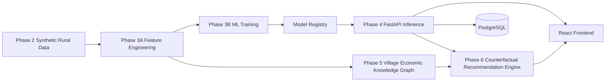
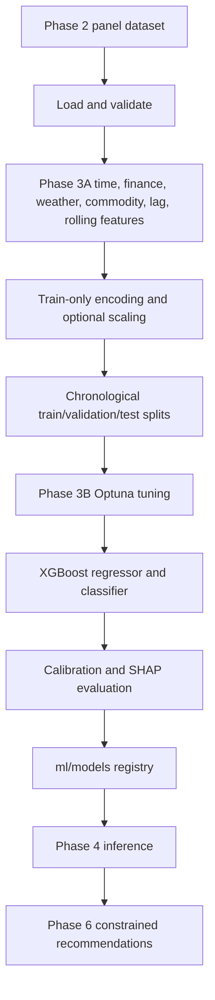

# GramNadi AI

### Predict the Shock. Trace the Ripple. Prescribe the Response.

[](https://www.python.org/)
[](https://fastapi.tiangolo.com/)
[](https://react.dev/)
[](LICENSE)

GramNadi AI is an AI-powered Rural Enterprise Resilience Platform for rural
micro-enterprises, field officers, banks, and financial institutions. It
combines enterprise finance, UPI activity, weather, commodity prices,
seasonality, and market events to forecast future cash flow, identify financial
risk, trace village-level economic relationships, and recommend constrained
actions before financial stress becomes a default.

## Project overview

Rural enterprises are affected by interacting shocks: a weather event can
change commodity prices, inventory costs, sales, loan repayment capacity, and
the health of neighboring businesses. GramNadi AI makes those relationships
operational through a modular data and decision-support platform.

The system currently provides:

- A deterministic synthetic rural-finance data generator for development and
  validation.
- A validated feature-engineering pipeline with chronological train,
  validation, and test splits.
- XGBoost cash-flow regression and financial-risk classification models.
- SHAP explanations, calibrated probabilities, confidence estimates, and
  prediction intervals.
- A NetworkX Village Economic Knowledge Graph with communities, centrality,
  similarity, and risk propagation.
- A constraint-aware counterfactual recommendation engine that searches for
  realistic actions using the existing ML predictor and graph evidence.
- Versioned FastAPI endpoints and a React/Vite frontend foundation.

## Key features

| Capability | Current implementation |
| --- | --- |
| Synthetic data | 36,000 monthly records across 1,000 enterprises and 10 sectors, with weather, commodities, loans, seasonality, market events, risk, and future targets |
| Feature engineering | 264 model-ready encoded features, validation, profiling, leakage checks, chronological splits, and reusable preprocessing artifacts |
| Cash-flow prediction | XGBoost regression for three-month future cash flow |
| Financial-risk prediction | Calibrated XGBoost classification for low, medium, and high risk |
| Explainability | SHAP feature importance, top positive/negative factors, dependence, and waterfall plots |
| Confidence | Calibrated probabilities, confidence levels, low-confidence flags, and regression intervals |
| Knowledge Graph | Weighted NetworkX graph with 1,055 nodes and 12,552 edges in the validated build |
| Graph intelligence | Community detection, PageRank, degree, betweenness, closeness, eigenvector centrality, similarity, and risk propagation |
| Recommendations | Bounded counterfactual search with business constraints, simulation, scoring, graph evidence, and top-five actions |
| APIs | Prediction, graph, recommendation, health, model-info, and existing domain CRUD APIs |
| Deployment foundation | Docker Compose services for PostgreSQL, FastAPI, and the React frontend |

## Architecture



### System components

- **Frontend:** React, TypeScript, Vite, TailwindCSS, React Router, Axios,
  and TanStack Query. The current UI contains the routed product foundation
  and placeholder product pages.
- **Backend:** FastAPI with versioned routing, Pydantic contracts, SQLAlchemy
  2.x, Alembic, application lifespan loading, ML/graph services, and domain
  CRUD services.
- **ML workspace:** Data generation, feature engineering, training, model
  registry, SHAP artifacts, and processed datasets under `ml/`.
- **Database:** PostgreSQL persistence for enterprise and resilience-domain
  records, separate from in-memory ML and graph analytics.
- **Knowledge Graph:** A cached weighted NetworkX property graph reused across
  graph and recommendation requests.

## Repository structure

```text
gramnadi-ai/
├── backend/
│   ├── alembic/                         # Database migration configuration
│   └── app/
│       ├── api/v1/routes/               # Domain, ML, graph, recommendation APIs
│       ├── core/                        # Application configuration
│       ├── counterfactual/              # Phase 6 engine and reports
│       ├── db/                          # SQLAlchemy session/base setup
│       ├── dependencies/                # Shared API dependencies
│       ├── graph/                       # Phase 5 graph and reports
│       ├── ml/                          # Phase 4 model loading and inference
│       ├── models/                      # SQLAlchemy domain models
│       ├── schemas/                     # Pydantic API schemas
│       ├── services/                    # Domain service layer
│       └── main.py                      # FastAPI application lifecycle
├── frontend/src/                        # React application source
├── ml/
│   ├── data_generator/                  # Phase 2 synthetic data engine
│   ├── feature_engineering/             # Phase 3A preprocessing
│   ├── training/                        # Phase 3B training and evaluation
│   ├── processed/                       # Processed data and preprocessing artifacts
│   └── models/                          # Trained model registry artifacts
├── datasets/                            # Generated datasets and reports
├── docs/                                # Extended documentation space
├── docker/                              # Shared Docker assets
├── scripts/                             # Repository automation space
├── .github/workflows/                   # CI workflow
├── docker-compose.yml                   # PostgreSQL, backend, frontend stack
├── .env.example                         # Environment template
└── README.md
```

## Technology stack

| Layer | Technologies |
| --- | --- |
| Frontend | React, TypeScript, Vite, TailwindCSS, React Router, Axios, TanStack Query |
| Backend | Python 3.11+, FastAPI, Uvicorn, Pydantic v2, SQLAlchemy 2.x, Alembic, Psycopg 3 |
| Machine learning | XGBoost, Optuna, SHAP, scikit-learn, pandas, NumPy, joblib |
| Graph analytics | NetworkX, community detection, centrality algorithms |
| Database | PostgreSQL 16 |
| Visualization | Matplotlib, SHAP plots, graph and risk diagnostic plots |
| Quality | Black, isort, flake8, ESLint, Prettier, GitHub Actions |
| Deployment | Docker, Docker Compose, Nginx |

## Implementation progress

| Phase | Scope | Status |
| --- | --- | --- |
| Phase 0 | Project foundation and architecture | Completed |
| Phase 1 | Backend domain foundation and persistence APIs | Completed |
| Phase 2 | Synthetic rural enterprise data generation | Completed |
| Phase 3A | Feature engineering and preprocessing | Completed |
| Phase 3B | XGBoost training, calibration, evaluation, and SHAP | Completed |
| Phase 4 | FastAPI ML model loading and inference integration | Completed |
| Phase 5 | Village Economic Knowledge Graph | Completed |
| Phase 6 | Counterfactual Recommendation Engine | Completed |
| Phase 7 | Production frontend workflows | Pending |
| Phase 8 | Deployment hardening and observability | Pending |
| Phase 9 | Presentation and product demonstration | Pending |

## Machine-learning pipeline



The default Phase 3A dataset contains 36,000 rows and 78 source columns. The
processed model tables contain 264 encoded feature columns. The regression
target is persisted as `cash_flow_after_3_month` and exposed by the training
interface as `future_cashflow_3m`; the classification target is persisted as
`risk_level` and exposed as `risk_label`.

## Village Economic Knowledge Graph

The graph is a cached weighted property graph built from the latest enterprise
snapshot in the Phase 2 panel. It represents:

- **Nodes:** enterprises, villages, commodities, weather regions, loan
  clusters, risk clusters, and the supported intervention node type.
- **Relationships:** Located In, Trades, Depends On, Affected By, Similar To,
  Shares Commodity, Shares Weather, Financial Dependency, and Received
  Intervention.
- **Community intelligence:** Louvain when available, with greedy modularity
  fallback.
- **Influence:** degree, betweenness, closeness, eigenvector centrality, and
  PageRank.
- **Queries:** neighbors, shortest paths, communities, similar enterprises,
  connected components, and risk neighborhoods.
- **Risk propagation:** deterministic neighborhood propagation for weather,
  commodity, financial, and village relationships.

Graph reports and diagnostic visualizations are written to
`backend/app/graph/reports/`. Intervention records are not present in the
synthetic Phase 2/3 source data, so intervention relationships remain empty
until real intervention records are supplied.

## Counterfactual Recommendation Engine

Phase 6 answers: “What should this enterprise change to improve its future?”

The engine:

1. Validates the enterprise’s 264-feature model-ready input.
2. Generates bounded candidates such as expense reduction, inventory
   optimization, loan burden reduction, commodity diversification, and reserve
   building.
3. Applies constraints for non-negative financial values, physical weather
   ranges, loan consistency, limited growth, and scenario realism.
4. Reuses the loaded Phase 4 predictor for each valid scenario.
5. Adds Phase 5 neighborhood, similarity, village, and risk-propagation
   evidence.
6. Scores cash-flow improvement, risk reduction, cost, difficulty, and the
   number of changed variables.
7. Returns up to five ranked recommendations with simulations, confidence,
   implementation difficulty, and explanations.

No LLM reasoning, model retraining, or database mutation is used by this
engine.

## API documentation

Interactive OpenAPI documentation is available at
`http://localhost:8000/docs`.

### ML inference APIs

| Method | Endpoint | Purpose |
| --- | --- | --- |
| POST | `/api/v1/ml/predict` | Single cash-flow and risk prediction with confidence and SHAP factors |
| POST | `/api/v1/ml/batch-predict` | Vectorized predictions for multiple enterprises |
| GET | `/api/v1/ml/model-info` | Model version, metrics, and feature count |
| GET | `/api/v1/ml/health` | Model, encoder, and inference readiness |

### Graph APIs

| Method | Endpoint | Purpose |
| --- | --- | --- |
| GET | `/api/v1/graph/summary` | Graph statistics, analytics, and community count |
| GET | `/api/v1/graph/statistics` | Node, edge, density, degree, and component statistics |
| GET | `/api/v1/graph/top-central` | Most central enterprise nodes |
| GET | `/api/v1/graph/enterprise/{enterprise_id}` | Enterprise attributes and neighborhood |
| GET | `/api/v1/graph/community/{community_id}` | Community members and attributes |
| GET | `/api/v1/graph/similar/{enterprise_id}` | Top similar enterprises |
| GET | `/api/v1/graph/risk-propagation/{enterprise_id}` | Propagated neighborhood risk |
| GET | `/api/v1/graph/health` | Graph readiness and node/edge counts |

### Recommendation APIs

| Method | Endpoint | Purpose |
| --- | --- | --- |
| POST | `/api/v1/recommend` | Generate ranked counterfactual recommendations |
| POST | `/api/v1/recommend/batch` | Generate recommendations for up to 50 enterprises |
| GET | `/api/v1/recommend/history/{enterprise_id}` | Read in-memory recommendation history |
| GET | `/api/v1/recommend/health` | Recommendation, ML, and graph readiness |

### Platform and domain APIs

| Method | Endpoint | Purpose |
| --- | --- | --- |
| GET | `/api/v1/health` | Backend health |
| GET | `/api/v1/version` | Application name and version |
| CRUD | `/api/v1/enterprises`, `/financial-records`, `/loans` | Enterprise financial domain records |
| CRUD | `/api/v1/commodity-prices`, `/weather-snapshots` | Environmental and market records |
| CRUD | `/api/v1/predictions`, `/prediction-explanations` | Persisted prediction records and explanations |
| CRUD | `/api/v1/interventions` | Intervention records |

## Example requests and responses

The ML and recommendation endpoints use the same 264-feature model-ready
payload. This concrete local example builds a valid payload from the processed
test table:

```python
import json
import pandas as pd
import requests

feature_names = json.load(open("ml/models/feature_metadata.json"))["features"]
row = pd.read_parquet("ml/processed/test.parquet").iloc[0]
features = {
    name: value.item() if hasattr(value, "item") else value
    for name, value in ((name, row[name]) for name in feature_names)
}

prediction = requests.post(
    "http://localhost:8000/api/v1/ml/predict",
    json={"enterprise_id": "enterprise-000973", "features": features},
)
print(prediction.json())

recommendation = requests.post(
    "http://localhost:8000/api/v1/recommend",
    json={"enterprise_id": "enterprise-000973", "features": features},
)
print(recommendation.json())
```

A prediction response includes the future cash-flow estimate, risk label and
probabilities, confidence, interval, model metadata, timestamp, and SHAP
factors. A recommendation response additionally includes ranked actions,
changed variables, simulation results, graph evidence, cost, difficulty, and
explanation.

## Measured performance

These values are engineering baselines from the current local validation runs,
not service-level guarantees.

| Operation | Measured result |
| --- | ---: |
| Single ML inference | ≈70 ms |
| Batch ML inference, 100 enterprises | ≈126 ms |
| Graph build | ≈8 seconds |
| Graph query latency | ≈45 ms average |
| Single recommendation | ≈114 ms |
| Batch recommendations, 50 enterprises | ≈4.77 seconds |

## Implemented algorithms

- XGBoost Regressor and Classifier
- Optuna hyperparameter optimization
- Platt/isotonic probability calibration
- SHAP tree explanations
- NetworkX Louvain/greedy modularity community detection
- Degree, betweenness, closeness, eigenvector, and PageRank centrality
- Enterprise similarity scoring
- Deterministic graph risk propagation
- Constraint-aware counterfactual optimization and ranking

## How to run

### Prerequisites

- Python 3.11 or newer
- Node.js 20.19+ or Node.js 22+
- Docker Desktop for the containerized stack
- PostgreSQL 16+ for native database setup

### Local setup

```bash
cp .env.example .env

cd backend
python3 -m venv .venv
source .venv/bin/activate
pip install -r requirements.txt
uvicorn app.main:app --reload
```

In another terminal:

```bash
cd frontend
npm ci
npm run dev
```

Services run at `http://localhost:5173`, `http://localhost:8000`, and
`http://localhost:8000/docs`; PostgreSQL listens on `localhost:5432`.

### Run data, feature, and training pipelines

From the repository root, using the backend virtual environment:

```bash
backend/.venv/bin/python -m ml.data_generator
backend/.venv/bin/python -m ml.feature_engineering
backend/.venv/bin/python -m ml.training
```

The FastAPI service loads the resulting artifacts; it does not train models at
startup.

### Docker Compose

```bash
cp .env.example .env
docker compose up --build
```

Compose starts PostgreSQL, the backend container, and the frontend container.
ML artifacts must be available to the backend runtime when deploying
ML-enabled inference outside the repository development environment.

## Quality checks

```bash
cd backend
black --check app alembic
isort --check-only app alembic
flake8 app alembic
python -m compileall -q app
```

```bash
cd frontend
npm run lint
npm run format:check
npm run build
```

## Repository highlights

- Modular boundaries between data, features, training, inference, graph
  intelligence, recommendations, and persistence.
- Explainable ML outputs rather than opaque predictions alone.
- Graph-based village and neighborhood context for decision support.
- Constraint-aware recommendations that avoid impossible scenarios.
- Reproducible local artifacts and reports for engineering review and demos.

## Future work

- Complete production frontend workflows and decision-support visualizations.
- Add authentication, authorization, audit trails, and role-specific access.
- Connect live weather, commodity, banking, and UPI providers.
- Add monitoring, model drift checks, observability, and alerting.
- Harden artifact delivery and cloud deployment.
- Prepare the final product demonstration and presentation.

## Contributors

GramNadi AI is developed by the project team. Team member names and roles can
be added here when the final team roster is published.

## License

This project is released under the [MIT License](LICENSE).
